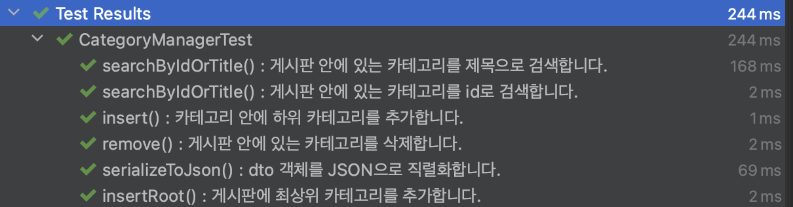

## 한터글로벌 과제전형 리포지토리
지원자 : 김노아

## 1.Board

CategoryType <br>
: 각 카테고리의 타입을 정의합니다. <br>
 타입에는 **ROOT**, **SUB**, **GENERAL**, **NOTICE**, **ANONYMOUS** 등이 있으며, 이를 통해 카테고리의 성격을 구분합니다.

CategoryDto <br>
: 카테고리 데이터를  Json 형식으로 직렬화할 수 있는 기능을 제공합니다. <br>
이를 통해 카테고리 정보를 클라이언트에 전달하거나 외부 시스템과 데이터를 교환할 수 있습니다.

Test Result <br>
: 모든 테스트를 통과하였습니다. 



## 2.Coin

단일 코인 종류만으로 합을 만드는 경우의 수를 계산 <br>
: 각 행은 해당 코인만을 사용하여 만들어진 합의 경우입니다.

|           | 1      | 2      | 3      | 4      |
|-----------|--------|--------|--------|--------|
| 1         | 1      | 1      | 1      | 1      |
| 2         | 0      | 1      | 0      | 1      |
| 3         | 0      | 0      | 1      | 0      |

<br>

복수개의 코인 종류를 사용하여 합을 만드는 경우의 수를 계산 <br>
: 각 행은 해당 코인만을 사용하거나 해당 코인 이하의 값들을 사용하여 합을 만듭니다.

|             | 1 | 2 |      3      |      4      |
|:-----------:|---|---|:-----------:|:-----------:|
|      1      | 1 | 1 |      1      |      1      |
|      2      | 0 | 1 | 0+1 (1*1+2) | 1+1 (1*2+2) |
|      3      | 0 | 0 |      1      | 0+1 (1*1+3) |
|  **total**  | 1 | 2 |      3      |      4      |

<br>

점화식 도출 <br>
: 단일 코인으로 합을 만드는데 실패하는 경우, 다른 코인과의 조합을 사용하여 합을 만들어야 합니다. <br>
이렇게 만든 합의 경우의 수는 이전 경우의 수에 더해집니다. <br>
이러한 경우 아래와 같은 점화식이 도출됩니다.

```DP[sum] += DP[sum-coin]```
